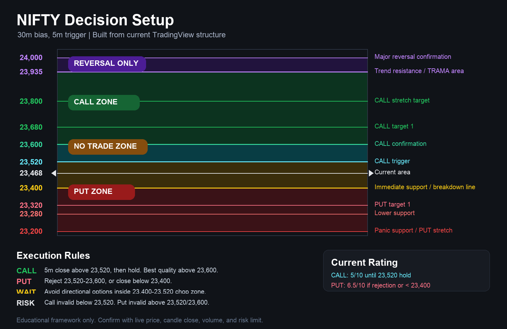

# TradingView NIFTY Decision Tools


Open-source TradingView Pine Script tools for NIFTY intraday decision support.

This repository contains chart indicators, a Strategy Tester version, and written trading playbooks for reading NIFTY setups with levels, trend filters, VWAP, ATR, volume, option-chain context, and manual news/event risk inputs.

> This project is for education and decision support only. It is not financial advice, a trade recommendation service, or an automated trading system.

## Preview



## What's Included

| File | Purpose |
| --- | --- |
| `trading-setups/nifty_pro_decision_map_v2_indicator.pine` | Main TradingView indicator with dashboard states, alerts, risk blocks, and manual market context inputs. |
| `trading-setups/nifty_pro_decision_map_v2_strategy.pine` | Strategy Tester version for baseline backtesting of the confirmed decision logic. |
| `trading-setups/nifty_best_call_setup.pine` | Earlier decision-map script focused on one NIFTY call/put setup structure. |
| `trading-setups/nifty_best_setup_minimal.pine` | Minimal copy of the v2 decision map for quick chart workflow testing. |
| `trading-setups/nifty_pro_decision_map_v2_usage.md` | Usage guide for the v2.3 decision map. |
| `trading-setups/nifty_best_call_plan.md` | Written execution framework for the 13 May 2026 NIFTY setup. |
| `trading-setups/nifty_best_call_map.png` | Visual level map used by the setup guide. |

## Core Ideas

- Separate market quality from directional edge.
- Prefer confirmed candle-close signals over intrabar noise.
- Use VWAP, EMA, ADX/DMI, ATR, volume, and manual option-chain levels together.
- Treat `WAIT` and `NO TRADE` as first-class states, not failures.
- Keep news and event risk manual so the trader stays responsible for context.

## How To Use

1. Open TradingView and create a new Pine Script.
2. Copy one of the `.pine` files into the Pine Editor.
3. Save and add it to a NIFTY chart.
4. For the v2 indicator, update the manual inputs under `One-place trading check`.
5. Use the usage guide before relying on the dashboard or alerts.

Recommended starting point:

```text
trading-setups/nifty_pro_decision_map_v2_indicator.pine
```

For backtesting, use:

```text
trading-setups/nifty_pro_decision_map_v2_strategy.pine
```

Run strategy tests on standard candles. Avoid final validation on Heikin Ashi, Renko, Range, Kagi, Line Break, or other synthetic chart types.

## Alerts

The v2 indicator includes alert conditions for:

- `NIFTY v2.3 CALL READY`
- `NIFTY v2.3 PUT READY`
- `NIFTY v2.3 NO TRADE`
- `NIFTY v2.3 State changed`

Markers appear when the state transitions into a ready state, not on every qualifying candle.

## Risk Notice

Trading index options and intraday setups can involve rapid losses. Backtests are not live trading results, and TradingView strategy fills can differ from real execution.

Use this repository as a study and decision-support tool. Always apply your own risk management, position sizing, and independent judgment.

## Contributing

Contributions are welcome. Good pull requests usually include:

- A clear explanation of the market behavior or script issue being improved.
- Pine Script changes that avoid repainting unless explicitly documented.
- Updated documentation when inputs, states, alerts, or defaults change.
- A screenshot or chart image when the visual dashboard changes.

## License

Released under the [MIT License](LICENSE).
